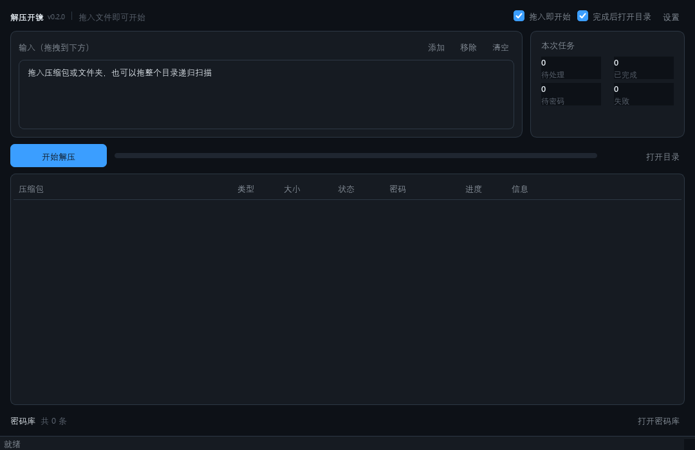
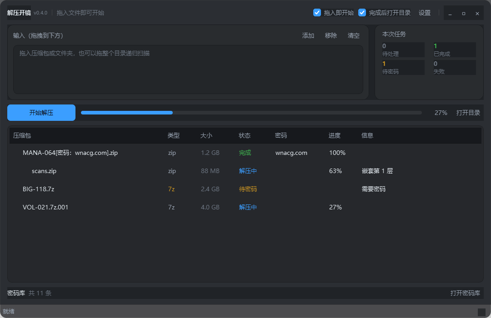
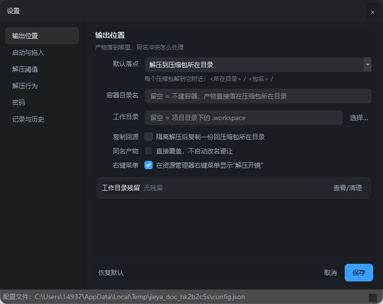
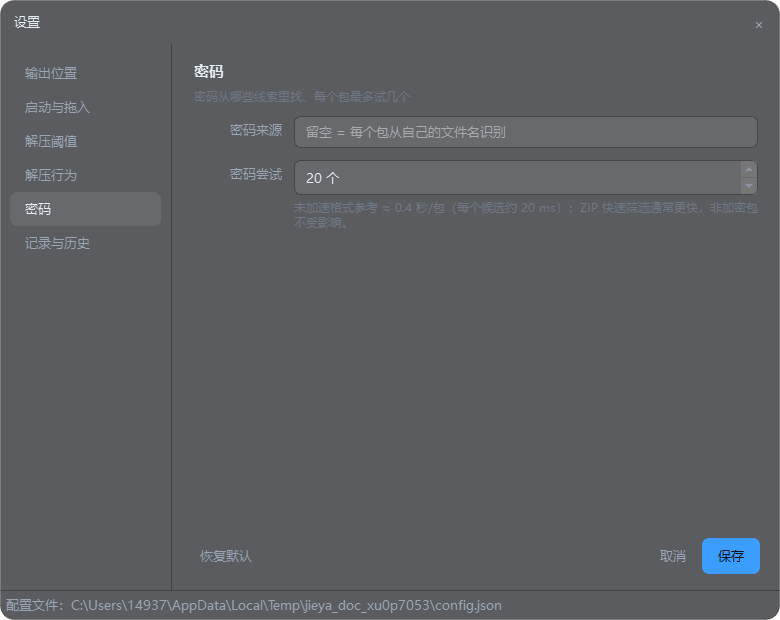

# 解压开镜

> 把互联网上那些乱七八糟的多层压缩包，一次性解干净。

当前版本：**0.3.1** · [更新记录](CHANGELOG.md)

从网盘拖下来的一堆 `.zip`，打开里面还是 `.rar`，再打开里面是加密的 `.7z`，密码写在文件名里、或者藏在站点域名里——手动解压是纯粹的体力劳动。**解压开镜**把这个过程做成一条自动流水线：递归解压到最内层、自动提取并尝试密码、把试通的密码记进密码库，下次遇到同来源的包直接命中。



## 核心能力

- **递归解压** — BFS 逐层展开内层压缩包，深度上限可配（默认 5 层）。通过文件头识别改名的伪装包（`.dat`、无扩展名等），并验证视频内嵌 ZIP 的目录与边界。
- **层级与包名都留在产物里** — 内层压缩包的包名会保留成一级目录，而不是把内容拍平混进外层：`新建压缩文件.zip`（内含 `内层真名.zip`）解出来是 `新建压缩文件/内层真名/…`。一个外层套多个内层包时各占一个目录，翻产物时能看出东西是从哪个包来的。
- **密码四级来源** — 按命中率排序依次尝试：文件名/注释正则提取 → 来源域名派生 → 密码库历史记录 → 内置常用字典。
- **ZIP 密码快速预筛** — 支持 ZipCrypto 与 WinZip AES，先排除多数错误候选，再由 7-Zip 完整解压验证；查找时显示候选进度。非 ASCII 密码、分卷和特殊格式沿用原验证路径，实测与复现见 [密码速度说明](docs/password-speed.md)。
- **密码库自学习** — 试通的密码自动入库并累计命中次数，按来源分组。来源只决定候选的**排序先后**、不做隔离：同一站点的包优先命中，跨站点的历史密码照样会被试到。
- **重跑幂等** — 已成功解压、输入未变化且产物仍在的包，重跑时直接跳过，不会在源目录里越堆越多 `包名 (2)`、`包名 (3)`。输入被替换或分卷发生变化、产物被删除时会重新解压；需要强制重解用 `--force`。
- **分卷归并** — 识别 `.partNN.rar` 与 `.7z.001` 两派命名，只解首卷。视频载体中的内层分卷也会按组归并，并查找同目录中包含配套分卷的载体。
- **护栏** — 解压后总大小上限（默认 50 GiB）与压缩比上限（默认 1000:1），防 zip bomb；加密包同样生效（拿到密码后复探真实大小）。
- **输出落点可选** — 解到源目录（产物目录直接以包名命名，不套容器层）、或解到隔离工作目录再决定是否交回源；默认同名输出自动避让。启用覆盖时先在工作目录解压，成功后再交付，失败不会提前删除已有产物。同盘交付优先移动，减少复制开销。
- **解压过程可见** — 任务列表逐行显示每个压缩包的**实际格式**与**大小**（鼠标悬停还能看到解压后大小与文件数）。格式取自 7z 的真实判定而非扩展名，所以 `.7z.001` 这类分卷、伪装成 `.dat` 的包都能显示对；加密包用警示色标出。



- **三种入口** — 主窗口、命令行与 Windows 右键自动解压，共用同一套引擎。右键窗口显示阶段、进度和耗时，自动密码未命中时直接显示密码输入框。

## 环境要求

| 依赖                              | 说明                                                            |
| ------------------------------- | ------------------------------------------------------------- |
| Python                          | 3.10+，仅源码运行或打包时需要；使用已打包 EXE 无需安装                              |
| [7-Zip](https://www.7-zip.org/) | 必需。引擎是 `7z.exe` 子进程，不是纯 Python 归档库——格式覆盖、GBK 文件名还原、加密与分卷探测都靠它 |
| PySide6                         | 源码图形界面需要；EXE 已包含，纯命令行可不装                                      |

`7z.exe` 的定位顺序：显式 `--sevenzip` 参数 → 环境变量 `SEVENZIP_PATH` → 常见安装路径（`C:\Program Files\7-Zip\` 等）→ 系统 `PATH`。

## 快速开始

Windows 用户可直接双击 `dist/JieyaKaijing.exe` 打开主窗口。首次使用请先安装 7-Zip。
  
把压缩包或文件夹拖到窗口任意位置，默认延迟 1.2 秒开始解压，连续拖入会合并成一次任务。
  
可在设置里调整「拖入即开始」行为。

源码运行图形界面：

```bash
# 图形界面
python cli.py gui
# 或
python -m ui
```

### Windows 右键自动解压

在图形界面的「设置 → 输出位置」勾选“右键菜单”即可启用；取消勾选即可移除。
  
菜单注册到当前用户，无需管理员权限，对所有文件和文件夹显示，并使用应用图标。
  
程序会自动尝试密码，把产物放到压缩包所在目录下的包名文件夹；自动密码未命中时显示
  
密码输入框，失败时显示错误提示。解压过程中不会弹出 7-Zip 的 CMD 窗口。

也可以使用命令行安装或移除：

```bash
python cli.py shell-install
python cli.py shell-uninstall
```

使用 EXE 时对应命令为 `JieyaKaijing.exe shell-install` 与 `JieyaKaijing.exe shell-uninstall`。
  
注册后请保持 EXE 路径不变；移动 EXE 后需从新位置重新启用菜单。

命令行递归解压：

```bash
python cli.py extract "E:/下载/某漫画" --source example.com
```

## 视频内嵌 ZIP

支持“视频 + ZIP + 干扰尾部”这类可播放的视频压缩包：自动验证内嵌 ZIP 目录，
  
在工作目录恢复真正的 ZIP 后解压，不需要改名，也不会修改源视频。
  
若不同载体装着同一个 7z/RAR 分卷组，选中其中一个文件时会自动查找同目录的配套载体，
  
汇集分卷后继续展开。恢复时会显示进度；临时副本在任务结束后自动清理。
  
此过程需要工作目录有足够空间保存真正的 ZIP 数据，不需要额外安装 WinRAR。
  
该功能针对验证通过的内嵌 ZIP，不代表支持所有自定义拼接或损坏格式；加密内容仍需要正确密码。

## 打包 Windows 程序

双击项目根目录的 `打包.bat` 即可生成单文件 `dist/JieyaKaijing.exe`。它会自动检查
  
Python 3.10+、PySide6 和 PyInstaller，并保留旧产物直到新产物生成成功。该 exe 可单独复制、直接双击
  
进入主界面；用户配置、密码库和工作目录会写入 `%LOCALAPPDATA%/解压开镜/`，不依赖
  
安装目录的写权限。目标机器仍需要安装 7-Zip，或设置 `SEVENZIP_PATH`。

打包使用 PyInstaller 单文件、无控制台模式，并禁用 UPX，应用与右键菜单共用 `ui/assets/app.ico`。
  
请分发 `dist` 中的 EXE。

## 命令行参考

```bash
# 递归解压（可传多个文件或目录）
python cli.py extract <路径...> [--source 站点域名] [--max-depth 5]
                              [--max-total-gb 50] [--max-ratio 1000]
                              [--timeout 3600]
                              [--samedir | --workdir-only] [--subdir 名字]
                              [--no-delete-intermediate] [--delete-original]
                              [--force] [--no-sniff] [--no-config]

# 密码库
python cli.py pass-add <密码> [--source 站点域名]
python cli.py pass-list

# 配置（持久化到 config.json）
python cli.py config                              # 打印当前配置
python cli.py config --set max_depth=6            # 可重复传多个
python cli.py config --set output_mode=samedir

# 工作目录残留：默认只盘点，删除必须显式 --yes
python cli.py clean-workdir                       # 列出残留 + 定性，不删任何东西
python cli.py clean-workdir --yes                 # 只清「产物已确认交付」的副本
python cli.py clean-workdir --yes --all            # 连「请保留/待确认」一起清（可能删掉唯一副本）
```

## 密码从哪来

候选密码按下列顺序合并，按原文去重并保留大小写差异，取前 `max_password_attempts` 个（默认 20）逐个尝试：

1. **文件名 / 注释里提取** — 命中的提示词如 `解压码`、`密码`、`passwd`，以及 `[xxx]` 方括号内容
2. **来源派生** — 由站点域名变形而来，实测命中率最高的一档
3. **密码库命中** — 全库参与，按「同来源 → 无来源 → 其他来源」分三档，档内按命中次数排序
4. **内置常用字典** — 兜底

> 顺序很关键：前两档是"这个包特有的线索"，后两档是"通用猜测"。高价值候选必须排在截断之前。
>
> 第 3 档**不做来源隔离**：来源只用来决定排序先后，不排除任何条目。站点归属不是
>   
> 可信边界——同一发布者会批量打包、用户也常复用同一密码。旧实现只查「同来源 +
>   
> 无来源」两组，跨来源的密码永远不会被试，而它是按文件名里的域名写入的，于是来源
>   
> 一分组就互不通气。

## 输出落点

三个维度正交，组合出四种行为：

| 配置项                   | 取值            | 说明                                        |
| --------------------- | ------------- | ----------------------------------------- |
| `output_mode`         | `samedir`（默认） | 解到 `<源目录>/<包名>/`                          |
|                       | `workdir`     | 解到隔离工作目录 `task_<id>/out/<包名>`             |
| `subdir_name`         | 默认空           | 留空 = **不建容器层**；填了才多一层 `<源目录>/<容器名>/<包名>/` |
| `copy_back_to_source` | 布尔            | 仅 `workdir` 模式有意义：是否复制回源目录                |
| `overwrite_existing`  | 布尔（默认关）       | 关闭时同名输出自动避让为 `包名 (2)`，绝不覆盖                |

不变式：**每个任务的产物目录都以它自己的包名命名**（`output_plan.archive_dir_name`）。
  
内层包先在自己的隔离目录里展开，交付时把这一级整目录搬到它在父产物中的原位置——
  
所以包名与层级在最终产物里都留得下：

```
下载/
  outer.zip                     ← 原件（keep_original）
  outer/                        ← 最外层的名字
    readme.txt
    sub/
      inner/                    ← 内层包名 + 它原本所在的子目录
        deep.txt
```

## 「解压成功」不等于「你拿到产物」

这两件事是分开的，界面与库都分开表达：

| 情况          | 任务状态                    | 界面               | 库里                      |
| ----------- | ----------------------- | ---------------- | ----------------------- |
| 解压成功 + 落点到位 | `done`                  | 绿色的「完成」          | `delivery_error=''`     |
| 解压成功 + 交付失败 | `done`（**不是** `failed`） | 黄色的「未交付」，原因写进信息列 | `delivery_error` 记着完整原因 |

判 `failed` 是错的——产物确实解出来了，用户该做的是去交付或清理，而不是重新解压
  
（重解只会被同名避让堆出一份新的）。所以用独立的 `delivery_error` 表达，并在收尾时
  
弹窗 + 命令行单独成段告知。

工作目录里的东西**全都是「解压成功」状态**，因此没有任何自动清理。入口在
  
**设置 → 输出位置 → 工作目录残留**（`N 项残留`，点「查看/清理」），逐项看到它是什么、占多少、能不能删：

| 定性  | 什么情况                            | 默认 |
| --- | ------------------------------- | -- |
| 可清理 | 产物已确认交付到工作目录**之外**，这份是冗余副本      | 勾选 |
| 请保留 | 交付失败、或库里的落点仍指向工作目录内部 —— 可能是唯一副本 | 不勾 |
| 待确认 | 库里查不到对应任务记录                     | 不勾 |

清理是**永久删除**（不进回收站），且有三道越界闸：目标必须是工作目录的直属
  
`task_<数字>` 子目录、不能是符号链接/junction、非勾选项一律不动。

## 设置窗口

左列选模块、右侧只渲染当前模块 —— 偏好分成 6 块，不必在一根长卷轴上找。

主界面只留「添加输入 → 开始解压」一条主线：解压深度/上限/密码来源/各类开关与
  
工作目录残留入口**全部**在这里，同一个值不会有两个地方能改。



划分规则是「数字归数字、开关归开关」：「解压阈值」页全是数值、「解压行为」页全是开关，每个开关都带自己的标签（`复制回源`、`原始包`…），不会读成上一行输入框的附属说明。底部操作条固定、不跟随滚动，短屏上「保存」也始终够得着。

密码相关的两项集中在「密码」页：**密码来源**（留空 = 每个包从自己的文件名识别）与**密码尝试**（每个包最多试几个候选，可设 1–2000）。后者下方实时显示「最坏 ≈ N 秒/需密码的包」——每个候选都要让 7z 重新派生一次密钥，实测约 20 ms，没有这行提示，用户会毫无察觉地把单个包的等待时间设成几十秒。



数字框的范围**只从 `core/appconfig.py` 的边界定义取一份**（`clamp_bounds`），UI 里不再出现第二份常量。两边各写一份时，界面会允许调到一个 core 不认的值、再在保存时被静默夹回去——用户看到自己的输入凭空消失，却说不出是谁干的。

## 架构

```
core/          纯 Python 引擎，零 Qt 依赖（有守卫测试保证）
  models.py        任务模型与状态枚举（Task / TaskStatus）
  pipeline.py      主流程编排：入队 → 探测 → 试密码 → 解压 → 内层入队 → 落地
  sevenzip.py      7z.exe 子进程封装
  probe.py         元数据探测、加密判定、zip bomb 检查
  archive_detect.py 文件头与内嵌 ZIP 识别、分卷识别、复合文档排除
  embedded_zip.py   视频内嵌 ZIP 边界验证与临时恢复
  runtime_paths.py  源码 / EXE 模式的配置、数据和工作目录定位
  shell_menu.py     Windows 当前用户右键菜单注册与图标刷新
  formatting.py    体积/数量的可读化格式化（纯函数，CLI 与 GUI 共用）
  password_finder.py 密码候选生成与排序
  vault.py         密码库（SQLite）
  store.py         任务状态机存储
  output_plan.py   输出落点决策（纯函数）
  workdir_cleanup.py 工作目录残留的盘点与清理（含三道越界闸）
  appconfig.py     用户偏好持久化 + 数值边界（`clamp_bounds` 是唯一真相源）
  config.py        运行期配置 + 7z 定位

ui/            PySide6 图形界面，单向依赖 core
  app.py             应用启动（组装主窗口 + 深色调色板）
  main_window.py     主窗口（拖入即开始）
  quick_extract_window.py 右键自动解压、进度与密码输入窗口
  settings_window.py 设置窗口（左导航 + 右内容页）
  vault_window.py    密码库管理窗口
  workdir_window.py  工作目录残留窗口
  theme.py           设计令牌与样式表
  worker.py          工作线程（QThread 桥接 core 的纯回调事件）

cli.py         命令行入口
main.py        EXE 入口（默认打开图形界面）
打包.bat       Windows 单文件打包脚本
```

**关键约束**：`core/` 不允许导入任何 Qt 模块，保证引擎可独立测试、可被 CLI 与 GUI 共用。这条约束由 `tests/test_core_no_qt.py` 静态守卫。

## 配置项

源码模式的配置保存在项目根目录 `config.json`；EXE 模式保存在
  
`%LOCALAPPDATA%/解压开镜/config.json`，密码库与任务工作目录也放在该用户数据目录。
  
首次启动自动生成，可用 `cli.py config --set` 或设置窗口修改。

| 键                       | 默认        | 含义                                                                                                                                               |
| ----------------------- | --------- | ------------------------------------------------------------------------------------------------------------------------------------------------ |
| `max_depth`             | 5         | 递归解压层数上限                                                                                                                                         |
| `max_total_gb`          | 50        | 解压后总大小上限（GiB）                                                                                                                                    |
| `max_ratio`             | 1000.0    | 压缩比上限                                                                                                                                            |
| `max_password_attempts` | 20        | 每个包尝试的密码候选数上限（可设 1–2000），也限制密码库贡献的候选数量。ZIP 自动快速预筛，其他格式逐个由 7-Zip 验证；设置窗口按未加速格式估算耗时（每个候选约 20 ms，实际取决于设备与文件）。非加密包不受影响 |
| `extract_timeout`       | 3600      | 单包解压超时（秒）。超大包在中低速磁盘上可能超过 1 小时，被误杀时报"解压失败"，可调大（上限 86400）                                                                                          |
| `sniff_archives`        | true      | 是否启用文件头与 ZIP 边界验证，识别伪装包和视频内嵌 ZIP                                                                                                                 |
| `skip_done`             | true      | 跳过输入指纹未变、已成功解压且产物仍在的包；`--force` 可强制重解                                                                                                            |
| `output_mode`           | `samedir` | 输出落点模式                                                                                                                                           |
| `subdir_name`           | 空         | 产物外的容器目录名。**留空 = 不建容器**，产物直接落在压缩包所在目录（`<源目录>/<包名>/`）；填了才多一层，适合下载目录很乱时把产物圈在一起                                                                     |
| `copy_back_to_source`   | true      | `workdir` 模式下是否复制回源目录                                                                                                                            |
| `overwrite_existing`    | false     | 是否允许覆盖同名输出；开启后先暂存解压，成功后交付                                                                                                                        |
| `delete_intermediate`   | true      | 成功后清理中间层压缩包                                                                                                                                      |
| `keep_original`         | true      | 是否保留原始输入包                                                                                                                                        |

## 测试

```bash
python -m pytest -q
```

0.3.1 验证基线为 **398 passed，1 skipped**。新增 ZIP 密码预筛（含短校验碰撞与格式回退）、复合后缀和分卷产物目录命名，以及 Windows 用户目录环境变量缺失场景测试。测试覆盖真实 `7z.exe` 的端到端解压链路（含加密包、伪装包、视频内嵌 ZIP、跨载体分卷、bomb 拦截、输入变化后的重跑、覆盖失败保护、同盘/跨盘交付、多层嵌套、大小写密码候选）与离屏界面测试（主窗口、右键进度与密码输入、设置、版本号一致性）。另有打包脚本、运行目录、右键注册与 Windows 子进程隐藏测试。

## 说明

仅供个人整理自己的下载文件使用，请遵守内容来源方的服务条款与当地法律法规。
