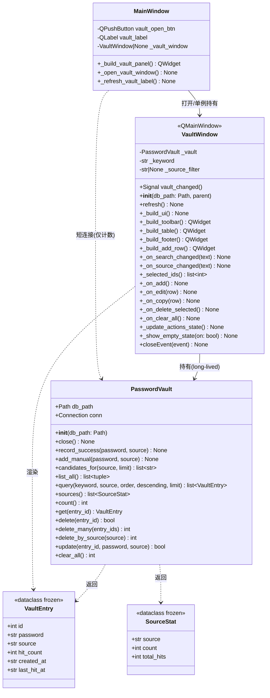
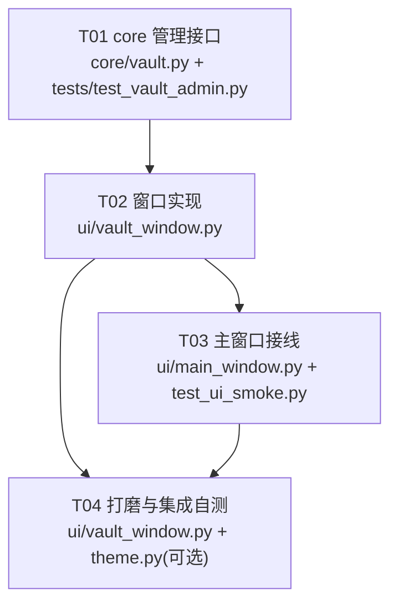

# 密码库管理窗口 — 系统设计与任务分解

> 架构师：高见远（Gao） · 项目：解压开镜 · 需求：「点击密码库之后开一个新窗口显示所有的密码」
> 文档版本：v1.0 · 状态：待实现

---

## Part A: 系统设计

### 1. 实现方案与范围判定

#### 1.1 核心矛盾

用户原话只有一句「开新窗口显示所有密码」，但当前 `PasswordVault` **只有"加"和"读"，没有"删"和"改"**。如果只做「把 `list_all()` 结果渲染成表格」，用户会得到一个**只能看、不能治理**的窗口：看到一条错录的密码、一条过期的来源，都无法清理。这类"只读列表窗口"价值极低，必然返工。

**本次设计的判断：把「显示所有密码」理解为「提供密码库的完整管理能力」，窗口只是管理能力的载体。** 因此 core 层必须补齐 CRUD 中缺失的 D 和 U，UI 层才有一个真正有用的窗口。

#### 1.2 范围判定

| 动作 | 文件 | 说明 |
|------|------|------|
| **新增** | `ui/vault_window.py` | 新窗口的全部实现（唯一新增大文件） |
| **新增** | `tests/test_vault_admin.py` | 新增管理接口的单元测试 |
| **修改** | `core/vault.py` | 追加管理方法，**不动**现有 4 个方法的签名与行为 |
| **修改** | `ui/main_window.py` | 折叠区简化为「打开密码库」按钮；接线窗口与计数刷新 |
| **修改** | `tests/test_ui_smoke.py` | 折叠区结构变了，断言需要跟随调整 |
| **不动** | `ui/theme.py` | 令牌齐全，本次**不需要**新增颜色 |
| **不动** | `cli.py` / `core/pipeline.py` / `core/store.py` | 接口向后兼容，无需改动 |
| **不动** | `tests/test_core_no_qt.py` 守护的规则 | `core/vault.py` 保持零 Qt 依赖 |

#### 1.3 为什么主窗口折叠区应当被「按钮 → 独立窗口」替换

现有折叠区（`_build_vault_panel`）是一个**内联的单行表单**：密码框 + 来源框 + 添加按钮。它的问题：

1. **能力天花板**：单行布局物理上装不下表格、筛选、批量选择、行内操作。要在折叠区里塞表格，会把主窗口的纵向空间吃掉一大块（主窗口 680px 高，任务树才是主角）。
2. **信息架构冲突**：主窗口的职责是「发起解压 + 观察进度」，密码库是**低频的后台数据治理**。把低频管理功能常年挂在主操作窗口上，违反项目既有的「默认视图保持安静」取向（见 `theme.py` 注释与 `test_fold_panels_collapsed_by_default`）。
3. **独立窗口带来真实收益**：可调整大小、可独立于主窗口停留、非模态（不阻塞解压）、未来可加列排序/导入导出，不受主窗口布局约束。
4. **主窗口保留轻量入口依然有价值**：「待密码」提示里引导用户去补密码的路径要顺畅——所以折叠区**不是删除，而是降级**为一个「打开密码库」按钮 + 计数标签。

**结论**：主窗口折叠区 → 保留为「打开密码库」按钮 + `密码库 · N` 计数；真正的增删改查全部迁移到独立窗口。

#### 1.4 架构模式

沿用项目既有的分层模式，**不引入新范式**：

- **core 层**：`PasswordVault` 作为 Data Mapper（SQLite 裸 SQL + 事务），方法返回原语/Pydantic-free 的 tuple/dataclass，**零 Qt 依赖**。
- **ui 层**：`VaultWindow(QMainWindow)` 作为 View，自持一个 `PasswordVault` 实例；View 不写 SQL，只调 core 方法。
- **依赖方向**：`ui/vault_window.py → core/vault.py`，单向，满足 `tests/test_core_no_qt.py`。

---

### 2. 文件清单

```
G:\code\解压开镜\
├─ core\
│  └─ vault.py                    [修改] 追加管理方法（D/U），保持现有 4 方法签名不变
├─ ui\
│  ├─ vault_window.py             [新增] 密码库管理窗口（唯一新增大文件）
│  ├─ main_window.py              [修改] 折叠区降级为按钮 + 打开窗口接线
│  └─ theme.py                    [不动]
├─ tests\
│  ├─ test_vault_admin.py         [新增] 删除/更新/筛选/统计 的单元测试
│  └─ test_ui_smoke.py            [修改] 跟随折叠区结构调整断言
└─ docs\
   ├─ vault-window-design.md      [本文档]
   ├─ class-diagram.mermaid       [新增] 类图
   └─ sequence-diagram.mermaid    [新增] 时序图
```

---

### 3. 数据结构与接口

#### 3.1 core 层新增接口（精确签名）

> 现有 4 个方法 `__init__ / close / record_success / add_manual / candidates_for / list_all` **签名与行为全部冻结**。

```python
from dataclasses import dataclass

@dataclass(frozen=True)
class VaultEntry:
    """一条密码记录的只读视图。列表统一返回它，替代裸 tuple。"""
    id: int
    password: str
    source: str
    hit_count: int
    created_at: str          # ISO 8601 (秒精度)
    last_hit_at: str | None  # ISO 8601 或 None


@dataclass(frozen=True)
class SourceStat:
    """按来源聚合的统计。"""
    source: str        # '' 表示"无来源"
    count: int         # 该来源下的密码条数
    total_hits: int    # 该来源下命中次数合计


class PasswordVault:
    # ---------- 冻结区（现有，禁止改动） ----------
    def __init__(self, db_path: Path) -> None: ...
    def close(self) -> None: ...
    def record_success(self, password: str, source: str = "") -> None: ...
    def add_manual(self, password: str, source: str = "") -> None: ...
    def candidates_for(self, source: str = "", limit: int = 50) -> list[str]: ...
    def list_all(self) -> list[tuple[str, str, int, str | None]]: ...

    # ---------- 新增区：读 ----------
    def query(
        self,
        keyword: str = "",
        source: str | None = None,   # None=全部；""=仅无来源；"a.com"=指定来源
        order: str = "source",        # "source" | "hits" | "recent" | "password"
        descending: bool = False,
        limit: int = 0,               # 0 = 不限
    ) -> list[VaultEntry]:
        """统一查询入口。keyword 对 password 与 source 做大小写不敏感的包含匹配。"""

    def sources(self) -> list[SourceStat]:
        """所有来源及各自条数/命中合计，按 count DESC, source ASC。含 source='' 的"无来源"。"""

    def count(self) -> int:
        """总条数。主窗口计数标签专用，避免拉全表。"""

    def get(self, entry_id: int) -> VaultEntry | None:
        """按主键取单条。"""

    # ---------- 新增区：写 ----------
    def delete(self, entry_id: int) -> bool:
        """删除单条。返回是否真的删到了（False = id 不存在）。"""

    def delete_many(self, entry_ids: list[int]) -> int:
        """批量删除，返回实际删除条数。空列表直接返回 0，不发 SQL。"""

    def delete_by_source(self, source: str) -> int:
        """删除某来源下全部密码，返回删除条数。source='' 表示无来源分组。"""

    def update(
        self,
        entry_id: int,
        password: str | None = None,   # None = 不改
        source: str | None = None,     # None = 不改（注意：显式传 "" = 改为无来源）
    ) -> bool:
        """修改密码/来源。返回是否成功。

        冲突处理：若改后与既有 (password, source) 撞 UNIQUE 约束，采用**合并语义**——
        把被编辑行的 hit_count 累加到冲突行、取两行 last_hit_at 的较晚者、删除被编辑行，返回 True。
        这样"两条重复密码合并"是自然行为，而不是让用户面对一个报错的对话框。

        合并时 last_hit_at 必须取 max，见 §3.3 合并 SQL 规范。
        """

    def clear_all(self) -> int:
        """清空整个密码库，返回删除条数。危险操作，UI 必须二次确认。"""
```

**为什么新增 `query()` 而不是扩展 `list_all()`**：`list_all()` 被 `cli.py`（`pass-list`）和 `main_window._refresh_vault_label()` 调用，返回裸 tuple。改它=破坏两个调用方。新增 `query()` 返回 `VaultEntry`，语义清晰，且窗口侧代码不用记 tuple 下标。

**为什么 `update()` 采用合并语义而不是抛异常**：用户编辑一条密码改成和另一条一样，业务上等价于「这两条是重复的，合并」。抛 `sqlite3.IntegrityError` 到 UI 再让用户去手动删旧的，是无意义的摩擦。

#### 3.3 `update()` 合并 SQL 规范（QA 发现的设计盲区，已确认修正）

**结论：合并时 `last_hit_at` 必须取两行的较晚者（`max`），不能只累加 `hit_count`。**

**理由**：`last_hit_at` 的语义是"这条密码最近一次被成功使用的时间"。`candidates_for()` 的候选排序依赖它（`ORDER BY hit_count DESC, last_hit_at DESC`）。若合并后保留旧值，会低估这条密码的活跃度，进而给出错误的候选顺序。合并虽是低频操作（仅用户手动编辑撞重复时发生），但**"低频"不等于"可以错"**——一旦发生就污染了候选排序依据，而候选排序正是密码库存在的全部意义。修一行 SQL 的成本远低于排查一次"为什么这个包试不出密码"。

**NULL 陷阱（实测确认）**：SQLite 标量 `MAX(a, b)` 只要**任一参数为 NULL 就返回 NULL**（不是返回非 NULL 的那个）。这很反直觉——`MAX(NULL, '2024-06-01')` 返回 `NULL`。

```
MAX(NULL, '2024-06-01')  ->  None    ← 会丢掉有效值！
MAX('2024-01-01', NULL)  ->  None
MAX(NULL, NULL)          ->  None
```

`last_hit_at` 完全可能为 NULL（手动添加、从未命中的密码）。因此**必须**用三层 `COALESCE` 兜底：

**推荐写法（已对 4 种 NULL 组合实测验证）**：

```sql
-- 变量：:keep_id（冲突保留行主键）、:edit_id（被编辑行主键）
-- 步骤 1：把被编辑行的 hit_count 与较晚的 last_hit_at 并入保留行
UPDATE passwords
   SET hit_count   = hit_count + (SELECT hit_count FROM passwords WHERE id = :edit_id),
       last_hit_at = COALESCE(
           MAX(last_hit_at, (SELECT last_hit_at FROM passwords WHERE id = :edit_id)),
           last_hit_at,                                          -- 兜底 1：保留行原值
           (SELECT last_hit_at FROM passwords WHERE id = :edit_id) -- 兜底 2：被编辑行值
       )
 WHERE id = :keep_id;

-- 步骤 2：删除被编辑行
DELETE FROM passwords WHERE id = :edit_id;
```

**为什么是三层 COALESCE 而不是 `CASE WHEN`**：`COALESCE` 从左到右取第一个非 NULL，天然表达"优先取较晚者，取不到就退而取任一方原值，都为 NULL 就保持 NULL"，三种情形一条语句覆盖，可读性远好于嵌套 `CASE`。三层顺序不可调换：第一层是正确语义，第二、三层是 NULL 兜底。

**实测结果（四种组合全部正确）**：

| 保留行 last_hit_at | 被编辑行 last_hit_at | 合并后 | 判定 |
|---|---|---|---|
| `2024-01-01` | `2024-06-01` | `2024-06-01` | ✅ 取较晚者 |
| `NULL` | `2024-06-01` | `2024-06-01` | ✅ 兜底 2 生效，未丢有效值 |
| `2024-01-01` | `NULL` | `2024-01-01` | ✅ 兜底 1 生效 |
| `NULL` | `NULL` | `NULL` | ✅ 保持 NULL |

> 注：`created_at` 不参与合并——它是"这条记录何时进库"，保留行的原值即为正确语义（被编辑行是一条即将消失的重复记录）。只有 `hit_count` 和 `last_hit_at` 需要跨行归并。

**测试要求（T01 必须补齐）**：`tests/test_vault_admin.py` 的合并用例须覆盖上表**全部 4 种组合**，不能只测"两行都有值"这一种。这 4 个断言是本条设计的证据，缺一不可。

> **【已实现并通过独立复核 · 架构师验证】** T01 已落地。架构师独立执行（非采信工程师转述）：
> - `python -m pytest -q` → **84 passed**（基线 51 + 新增 33）
> - 4 组合矩阵独立复跑全部 PASS（`test_update_merge_last_hit_takes_later`）
> - 定向防回归 `test_update_merge_last_hit_does_not_clobber_with_null` 覆盖 `MAX(NULL,x)` 陷阱点
> - `created_at` 保留原值断言通过
> - 候选排序回归 `test_update_merge_preserves_candidate_ordering` 通过（见下方**场景校准**）
> - 冻结方法（`record_success`/`add_manual`/`candidates_for`/`list_all`）行为与签名未变，`tests/test_vault.py` 零修改通过
>
> 工程师额外补充（超出原设计，已复核为正确增强）：`query()` 的 LIKE 通配符转义（`%`/`_`/`\` 按字面匹配）。实测 `keyword="a%b"` 仅命中 `a%b` 不误伤 `axxb`——此项为设计遗漏的正向补强。

##### 场景校准（架构师原建议有误，已修正 —— 防止后人写出"永不失败"的假回归测试）

架构师最初建议的排序回归场景 **是错的**：建议的「保留行=2025 / 被编辑行=NULL」组合**旧实现也会碰巧正确**——因为旧实现"不动保留行"，而保留行本就是 2025，排序自然对。**该场景测不出回归，是一个永不失败的假测试。**

真正暴露症状的是 **保留行=NULL / 被编辑行=有值**：旧实现下保留行永远为 NULL（丢掉被编辑行的较晚值），新实现才把它归并进来。架构师用模拟旧实现（只累加 hit_count、不动 last_hit_at）实测确认差异：

| 场景 | 旧实现合并后 | 新实现合并后 | 能否暴露回归 |
|------|-------------|-------------|-------------|
| kept=2025 / edited=NULL | `2025-01-01` | `2025-01-01` | ❌ 旧新一致，测不出 |
| **kept=NULL / edited=2025** | **`None`（丢值）** | **`2025-01-01`** | ✅ **真正暴露症状** |

**写排序回归测试必须用「保留行 NULL + 被编辑行有值」组合。** 工程师已据此实现 `test_update_merge_preserves_candidate_ordering`（含"从未命中"对照组 `other`，断言 `cands.index("late") < cands.index("other")`），架构师复核通过。

> 这条校准比原测试更有价值：它把"假回归测试"本身当成一种缺陷防住了。**回归测试必须先在旧实现上跑红，才有资格在实现后跑绿。**


#### 3.2 类图



---

### 4. 程序调用流程

见 `docs/sequence-diagram.mermaid`（独立文件）。核心流程：打开窗口 → 加载数据；行内/批量删除 → 刷新表格 + 通知主窗口计数。

---

### 5. 待明确事项

| # | 决策点 | 我的推荐（按此执行） | 理由 |
|---|--------|---------------------|------|
| Q1 | 窗口单例还是多实例 | **单例**。`MainWindow` 持 `self._vault_window`，关闭时置 `None` | 避免多窗口各持连接、各自持有一份陈旧视图；用户开两个密码库窗口没有任何场景 |
| Q2 | 长连接还是短连接 | **长连接**（窗口打开期间持有一个 `PasswordVault`，`closeEvent` 中 `close()`） | 窗口内高频查询/删除，短连接每次重开+重执行 schema 有成本；长连接在窗口生命周期内可控 |
| Q3 | 线程安全 | **不加锁，靠 WAL + 长事务边界**。`__init__` 里开 `PRAGMA journal_mode=WAL` + `busy_timeout=5000` | 见 §7 连接管理约定。解压线程写 db 时窗口读不会互相阻塞（WAL 读写不互斥） |
| Q4 | 是否要「修改」功能 | **要**，但简化为 Action 列的双击编辑（弹 `QInputDialog` 链式改密码/来源） | 一次做两个 `QInputDialog` 比重型内联编辑控件成本低得多，覆盖 95% 场景 |
| Q5 | 是否加 `delete_by_source` / `clear_all` | **要**。`clear_all` 放在页脚最右，`ghost` 样式 + 二次确认 | 治理能力必须完整，"只删单条"还是不够 |
| Q6 | 密码是否明文显示 | **默认明文中段打码**（`ab****cd`），选中/双击行可切换为明文；提供工具栏「显示明文」开关 | 自用工具，但也可能在投屏/截图场景被看到 |
| Q7 | 是否给 CLI 加管理子命令 | **本次不加**。core 接口已就绪，cli 侧后续按需追加 | 用户需求只提 GUI，避免范围蔓延 |

---

## Part B: 任务分解

### 6. 依赖包列表

**本次不引入任何新的第三方包。**

```
- PySide6              : 已有，UI 框架（QtWidgets / QtCore）
- sqlite3              : Python 标准库，数据存储
- dataclasses          : Python 标准库，VaultEntry / SourceStat
- pytest               : 已有，测试框架（含 pytest-qt？未安装，本设计不依赖它）
```

> 明确不使用 `pandas` / ORM / `qfluentwidgets` 等——项目取向是极简、无重依赖。

---

### 7. 任务列表（按依赖顺序，共 4 个任务）

#### T01 — core 层：密码库管理接口（D/U/筛选/统计）

- **涉及文件**：`core/vault.py`（修改）、`tests/test_vault_admin.py`（新增）
- **依赖**：无
- **优先级**：P0
- **内容**：
  1. 新增 `VaultEntry`、`SourceStat` 两个 frozen dataclass（放在 `core/vault.py` 内，不新建文件，保持模块自足）。
  2. 在 `PasswordVault.__init__` 中追加：
     `self.conn.execute("PRAGMA journal_mode=WAL")` 与 `self.conn.execute("PRAGMA busy_timeout=5000")`（**不改变** `close()` 行为）。
  3. 实现 `query / sources / count / get / delete / delete_many / delete_by_source / update / clear_all` 九个新方法，签名严格按 §3.1。
  4. **绝对不动**现有 6 个方法（`__init__` 除上述 PRAGMA 追加外、`close / record_success / add_manual / candidates_for / list_all`）。
  5. 新增测试 `tests/test_vault_admin.py`，覆盖：删除单条、批量删除、按来源删除、更新密码、更新来源、更新撞唯一约束触发合并（**必须覆盖 §3.3 表格中全部 4 种 last_hit_at NULL 组合**）、`query` 的 keyword/来源筛选/排序、`sources()` 聚合含空来源、`clear_all`。
- **验收标准**：
  - `python -m pytest tests/test_vault_admin.py tests/test_vault.py tests/test_core_no_qt.py -q` 全绿。
  - `tests/test_vault.py`（原有 3 个测试）**零修改**通过 → 证明接口向后兼容。
  - `tests/test_core_no_qt.py` 通过 → `core/vault.py` 无 Qt 导入。
  - **合并语义的 4 个 NULL 组合断言全部通过**（见 §3.3）；合并后 `hit_count` = 两行之和，`last_hit_at` = 较晚者。
  - 全局 `python -m pytest -q` 结果为 **51 + 新增用例数**，无失败。

#### T02 — core 层代码完成后的 UI 骨架：`VaultWindow`

- **涉及文件**：`ui/vault_window.py`（新增）
- **依赖**：T01
- **优先级**：P0
- **内容**：
  1. `class VaultWindow(QMainWindow)`，构造签名 `__init__(self, db_path: Path, parent=None)`；内部 `self._vault = PasswordVault(db_path)`，`closeEvent` 中 `self._vault.close()`。
  2. `Signal vault_changed = Signal()`（`PySide6.QtCore`）；任何写操作成功后 `emit`。
  3. 三段式布局：
     - **顶部工具条**：搜索框（`QLineEdit`，placeholder「搜索密码或来源」，`textChanged` 防抖 200ms 触发 `refresh`）+ 来源下拉（`QComboBox`，首项「全部来源」，其次由 `vault.sources()` 填充，显示为 `a.com (12)`）+ 「显示明文」`QCheckBox` + 右侧主操作「新增」（`primary="true"`）。
     - **中部表格** `QTableWidget`（或 `QTableView` + 自定义 model，二选一，推荐 `QTableWidget` 以降低实现成本）：`setSelectionBehavior(SelectRows)`、`setSelectionMode(ExtendedSelection)`、`verticalHeader().setVisible(False)`、`setAlternatingRowColors(False)`、`setEditTriggers(NoEditTriggers)`。
     - **页脚**：左侧「已选 N 项」提示 + 「删除选中」（`ghost`，无选中时 disabled）；右侧次要信息 + 「清空密码库」（`ghost`）。
  4. **空状态**：当 `query()` 返回空且无筛选条件 → 表格隐藏，展示居中引导 Label（`TEXT_FAINT`）：「密码库还是空的 · 解压命中密码会自动入库，也可以点右上角「新增」手动添加」；当有筛选条件但无结果 → 提示「没有匹配「{keyword}」的密码」。复用 `InputList` 的「引导项不可选」思路，这里用独立 Label 覆盖层更简单。
  5. **删除确认**：单条/批量删除用 `QMessageBox.question`；`clear_all` 用 `QMessageBox.warning`，文案含条数。
  6. UI 中**不出现任何字面色值**，全部通过 `ui.theme` 令牌（`theme.ERR` 用于「清空」hover 提示、`theme.TEXT_FAINT` 用于空态）或 QSS 属性（`primary="true"` / `ghost="true"` / `panel="true"`）表达。
- **表格列定义**：

  | 列 | 表头 | 数据来源字段 | 建议宽度 | 说明 |
  |----|------|-------------|---------|------|
  | 0 | 密码 | `VaultEntry.password` | 220（`Stretch`） | 默认打码 `ab****cd`；「显示明文」开启或该行被选中时显示原文；`setToolTip` 恒为原文 |
  | 1 | 来源 | `VaultEntry.source`（空显示「无来源」`TEXT_FAINT`） | 180 | 可点击表头按来源排序 |
  | 2 | 命中 | `VaultEntry.hit_count` | 70（居中） | 数值右对齐；0 显示 `—` |
  | 3 | 最近命中 | `VaultEntry.last_hit_at`（None 显示 `从未`） | 150 | 只显示 `YYYY-MM-DD HH:MM`，秒截断 |
  | 4 | 添加时间 | `VaultEntry.created_at` | 150 | 同上 |
  | 5 | 操作 | 派生列 | 110 | 两个 `ghost` `QPushButton`：「复制」「编辑」。`QTableWidget` 的 `setCellWidget` 挂载，或更省事地绑定双击行 → 编辑 |

  > 实现建议：列 5 用 `setCellWidget` 会让「批量删除」的选中语义变复杂。**推荐方案**：不设操作列，改为**右键上下文菜单**（复制 / 编辑 / 删除）+ 双击行 = 编辑。表格更干净，也省掉 `setCellWidget` 的生命周期坑。列 0~4 即可。
- **验收标准**：
  - 窗口能独立构造并在 offscreen 模式下 `show()`/`close()` 不崩溃。
  - 构造一个含若干条记录的临时 db，`refresh()` 后 `table.rowCount() == query().len()`。
  - 无筛选且库为空时，空态 Label 可见、表格不可见。
  - 搜索框输入不存在的关键字 → 显示「无匹配」态，`rowCount() == 0`。
  - 全文件 `grep` 无 `#[0-9a-fA-F]{6}` 形式的字面色值。

#### T03 — 主窗口接线：折叠区降级 + 单例窗口 + 计数同步

- **涉及文件**：`ui/main_window.py`（修改）、`tests/test_ui_smoke.py`（修改）
- **依赖**：T02
- **优先级**：P0
- **内容**：
  1. `_build_vault_panel()` 重写：去掉密码框/来源框/添加按钮/`vault_body` 折叠体。保留一个 `QToolButton[section="true"]` 作为**视觉分组标题**（不可展开、不可 check），右侧放一个 `QPushButton`「打开密码库」+ `self.vault_label`（计数）。或者更简：一行 = `QLabel("密码库")` + 计数 + 按钮。**推荐**：保留 `section` 标题栏的视觉一致性，但去掉 `checkable`。
  2. **删除**不再需要的成员与方法：`self.vault_body`、`self.pass_edit`、`self.pass_source_edit`、`_on_vault_toggled()`、`_add_password()`。`_refresh_vault_label()` **保留但改写**为用 `vault.count()`（而非 `len(vault.list_all())`）。
  3. 新增 `self._vault_window: VaultWindow | None = None` 与 `_open_vault_window()`：
     - 若 `self._vault_window is None` → 构造 `VaultWindow(DEFAULT_DB, parent=self)`，接 `vault_changed` → `self._refresh_vault_label()`，接 `destroyed` → `self._vault_window = None`。
     - 否则 → `self._vault_window.raise_()` + `activateWindow()`（单例复用）。
     - `show()`（非模态，不阻塞解压）。
  4. `_on_finished()` 中原来的「自动展开折叠区」逻辑改为：仍 `self._refresh_vault_label()`；把提示文案从「可在底部『密码库』补充密码」改为「可点右下角『打开密码库』补充密码」，并**不再**尝试 `setChecked`。
  5. `closeEvent` 中顺带 `self._vault_window` 若非 None 则 `close()`（避免子窗口独立存活）。
  6. `tests/test_ui_smoke.py` 调整：`test_fold_panels_collapsed_by_default` 中删除对 `vault_toggle` 的断言（该控件已不存在），改为断言新按钮 `win.vault_open_btn.property("ghost") == "true"` 或存在性；其余「只有开始解压是 primary」的断言需确认 `vault_open_btn` **不是** primary。
- **验收标准**：
  - `MainWindow()` 构造成功，`hasattr(win, "vault_open_btn")` 为 True，`not hasattr(win, "vault_body")`。
  - 调用 `win._open_vault_window()` 两次，`win._vault_window` 指向同一对象（单例），且窗口未崩溃。
  - 模拟一次 `vault_changed` 发射 → `win.vault_label.text()` 更新为最新条数。
  - `win.start_btn` 仍是唯一 `primary="true"` 按钮。
  - `python -m pytest -q` 全绿。

#### T04 — 视觉与交互打磨 + 集成自测

- **涉及文件**：`ui/vault_window.py`（微调）、`ui/main_window.py`（微调，如需）、`ui/theme.py`（**仅在确有必要时**追加 1 个令牌）
- **依赖**：T03
- **优先级**：P1
- **内容**：
  1. 表格视觉：行高 30px（与主窗口树一致）、`QHeaderView::section` 已有样式直接复用；表头排序指示器开启（`setSortingEnabled(True)`），并对 `query(order=...)` 做映射。
  2. 密码列打码函数：`_mask(pwd)` → 长度 ≤ 2 时全 `*`；否则保留首尾各 1~2 位。放在 `ui/vault_window.py` 模块级（**不放 core**，这是纯展示逻辑）。
  3. 「复制」操作写系统剪贴板（`QApplication.clipboard().setText(明文)`），并在状态栏/页脚给一次轻提示。
  4. 危险操作的视觉：`clear_all` 按钮文案「清空全部」，hover 时通过 `theme.ERR` 作为 `QSS` 动态属性表达（如给按钮设 `setProperty("danger", "true")` 并在 `theme.build_stylesheet()` 中追加 `QPushButton[danger="true"]` 规则——**这是本任务唯一可能新增 1 条 QSS 规则的地方**，颜色必须用 `theme.ERR`）。
  5. 端到端手测清单（写入提交说明）：
     - 空库打开 → 空态；新增 2 条 → 表格刷新、主窗口计数 +2。
     - 搜索关键字过滤；按来源下拉筛选；清空筛选恢复全量。
     - 单条删除 → 表格、计数同步；批量删除 → 同步。
     - 编辑一条密码改成已存在的 → 合并，条数 -1，命中累加。
     - 清空全部 → 二次确认 → 空态、主窗口计数归 0。
     - 解压过程中打开窗口删密码 → 解压线程不报错（WAL 生效验证）。
- **验收标准**：
  - 上述手测清单逐项通过。
  - 全量 `python -m pytest -q` 全绿，总数 ≥ 51 + 新增。
  - offscreen 冒烟：`VaultWindow` 与 `MainWindow` 可同进程先后构造/销毁无异常。

---

### 8. 共享知识（跨文件约定）

```
【依赖方向】
- ui/* → core/* 单向。core/ 下任何文件禁止 import PySide6/PyQt（tests/test_core_no_qt.py 强制）。
- core/vault.py 不得出现任何 Qt 类型；返回 Python 原生类型 / dataclass。

【颜色与样式】
- 所有颜色只从 ui/theme.py 的令牌取：CANVAS/SURFACE/RAISED/LINE/LINE_SOFT/TEXT/TEXT_MUTED/
  TEXT_FAINT/ACCENT/ACCENT_HOVER/ACCENT_DOWN/ACCENT_TEXT/OK/WARN/ERR/STATUS_COLORS。
- 禁止在布局代码里写内联色值（如 "#F85149"）。需要强调时优先用 QSS 属性：
  primary="true"（唯一主操作）/ ghost="true"（文字次操作）/ panel="true"（面板容器）/
  section="true"（折叠分组标题）。新增属性须同时改 theme.build_stylesheet()。
- VaultWindow 内唯一允许的 primary 按钮是「新增」。删除/清空一律 ghost。

【连接管理（重要）】
- 主窗口：沿用"用完即关"短连接（_refresh_vault_label 里建→用→close），只为读一个计数。
- VaultWindow：长连接，窗口存活期间持有一个 PasswordVault；closeEvent 必须 close()。
- 并发：解压工作线程（ui/worker.ExtractWorker）会写同一 db。为降低 SQLITE_BUSY：
  PasswordVault.__init__ 统一设置 PRAGMA journal_mode=WAL + busy_timeout=5000。
  不做跨线程锁——WAL 下读写互不阻塞，busy_timeout 兜住偶发写写冲突。
- 一个 sqlite3.Connection 不跨线程使用（沿用现有约定）。

【错误处理】
- core 层写方法不吞异常，但 update() 对 UNIQUE 冲突做"合并语义"（见 §3.1），不向上抛 IntegrityError。
- UI 层：所有写操作包裹 try/except，失败弹 QMessageBox.critical，不静默。
  查询类失败（只读）可在状态栏提示并保留旧数据。

【命名约定】
- core 的 dataclass：PascalCase（VaultEntry / SourceStat），字段 snake_case。
- UI 私有槽：_on_xxx；构建函数：_build_xxx；刷新：refresh / _refresh_xxx。
- 主窗口成员沿用 self.xxx（如 self.vault_open_btn / self.vault_label），不用下划线前缀。

【数据格式】
- created_at / last_hit_at 均为 ISO 8601 秒精度字符串（core.vault._now()），UI 展示时截断到分钟。
- source 为空字符串 '' 代表"无来源"，UI 展示为「无来源」（TEXT_FAINT），不得显示为空。
- hit_count 为 0 时 UI 显示「—」而非 0。

【向后兼容红线】
- PasswordVault 现有 6 个方法的签名与语义不得改动（cli.py pass-add/pass-list、
  pipeline.record_success/candidates_for、main_window 计数 都在用）。
- tests/test_vault.py 现有 3 个测试不得修改。
```

---

### 9. 任务依赖图



**关键路径**：T01 → T02 → T03 → T04（4 个任务线性推进，无并行分支，因为窗口依赖接口、接线依赖窗口）。

**风险点**：T01 是本项目唯一的"设计风险源"——`update()` 的合并语义、`query()` 的排序映射需要测试覆盖到位，否则 T02/T03 会在联调时暴露。建议 T01 的测试先写。
